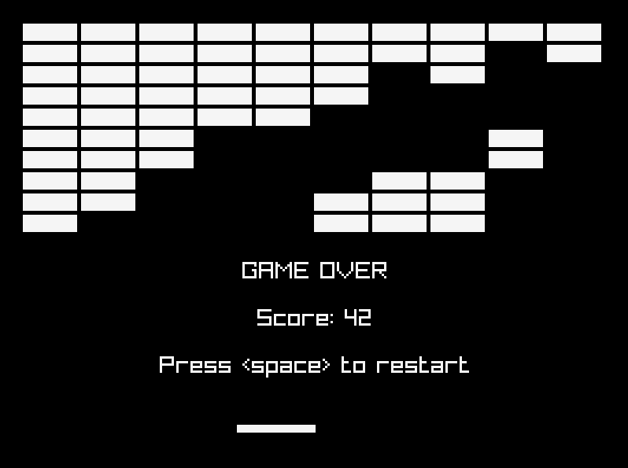
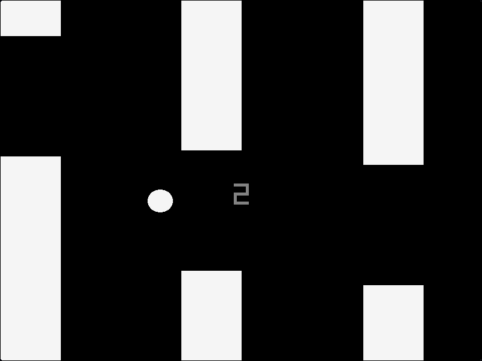
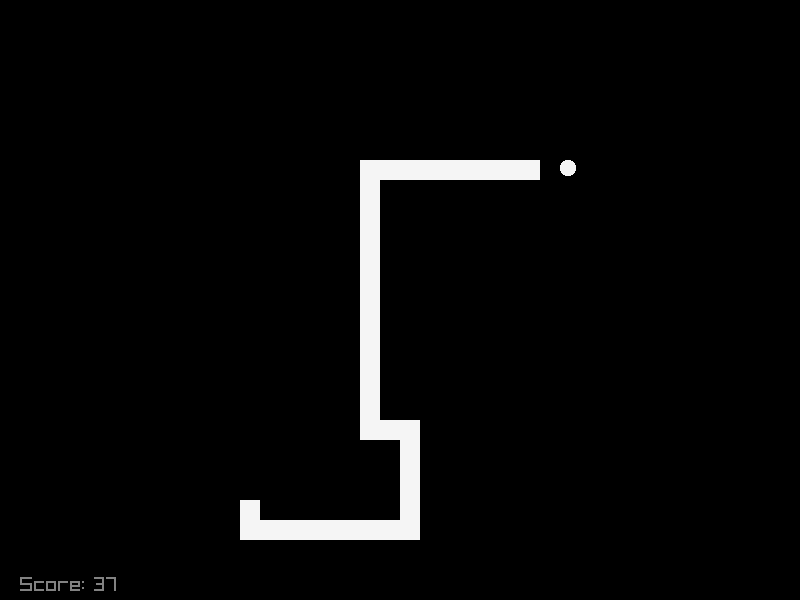

# Games
I made this to learn how to use raylib and also because making games is fun.

## Preview
<table>
  <tr>
    <td>Breakout</td>
    <td>Flappy Bird</td>
    <td>Snake</td>
  </tr>
  <tr>
    <td></td>
    <td></td>
    <td></td>
  </tr>
</table>

## Quickstart
```console
$ cc -o nob nob.c
$ ./nob
```
All the binaries will be in `build/` directory. Just run one from there. For example:
```console
$ ./build/breakout
```
