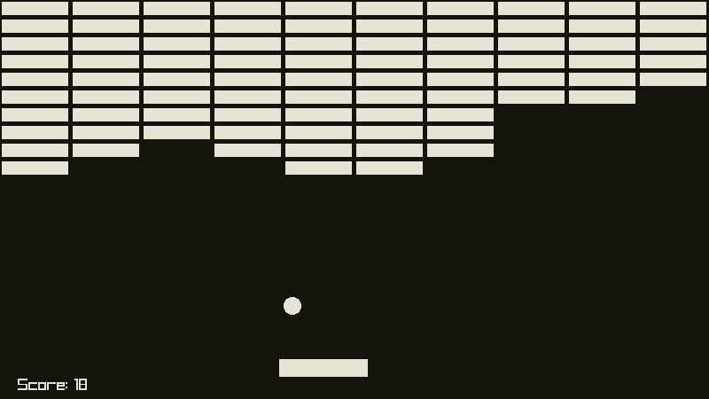
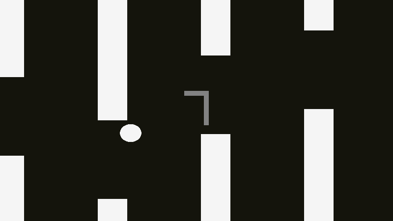
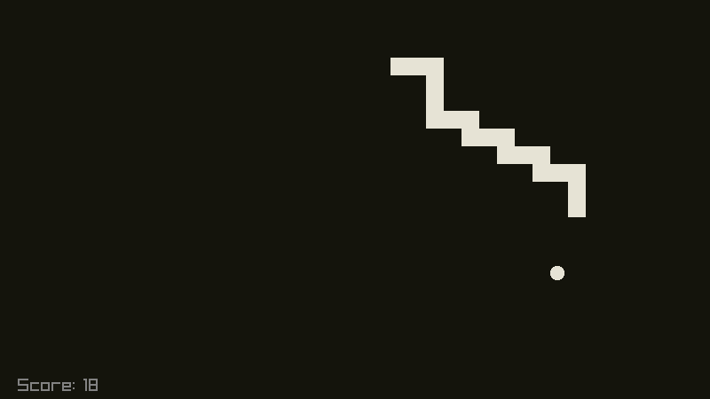

# Games
I made this to learn how to use raylib and also because making games is fun.

## Preview
<table>
  <tr>
    <td>breakout</td>
    <td>flappy_bird</td>
    <td>snake</td>
  </tr>
  <tr>
    <td></td>
    <td></td>
    <td></td>
  </tr>
</table>

## Quickstart
Bootstrap the build system. Only need to do this once.
```console
$ cc -o nob nob.c
```
Build and run any of the games.<br>
Currently available games: `breakout`, `flappy_bird`, `snake`
```console
$ ./nob -run breakout
```
